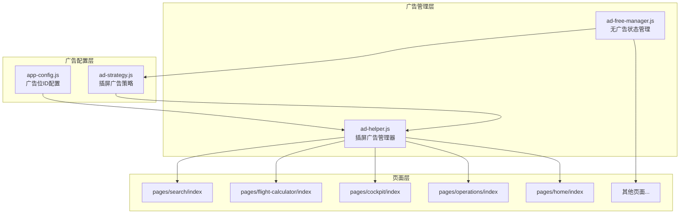

# Design Document: Ad Optimization

## Overview

本设计文档描述了 FlightToolbox 小程序广告系统优化的技术实现方案。主要目标是：
1. 暂停所有原生模板广告（横幅、竖版、全屏模板）
2. 保留并优化插屏广告，降低展示频率
3. 保留激励视频广告功能不变

## Architecture



## Components and Interfaces

### 1. app-config.js - 广告配置中心

新增原生模板广告全局开关：

```javascript
module.exports = {
  ad: {
    // 原生模板广告全局开关（新增）
    nativeTemplateAdEnabled: false,  // 设为 false 暂停所有原生模板广告
    
    // 插屏广告配置（保持不变）
    interstitialAdUnitId: 'adunit-1a29f1939a1c7864',
    
    // 激励视频广告配置（保持不变）
    rewardedVideoAdUnitId: 'adunit-079d7e04aeba0625',
    
    // 原生模板广告位ID（保留，但通过开关控制）
    nativeTemplateAdUnitIds: {
      fullScreen: 'adunit-d6c8a55bd3cb4fd1',
      vertical: 'adunit-d7a3b71f5ce0afca',
      horizontal: 'adunit-3a1bf3800fa937a2'
    }
  }
};
```

### 2. ad-strategy.js - 插屏广告策略

更新策略配置参数：

```javascript
var CONFIG = {
  // 插屏广告全局开关
  INTERSTITIAL_AD_ENABLED: true,
  
  // 基础时间间隔：5分钟
  BASE_TIME_INTERVAL: 5 * 60 * 1000,
  
  // 最少操作次数：5次
  MIN_ACTION_COUNT: 5,
  
  // 会话时长：30分钟
  SESSION_DURATION: 30 * 60 * 1000,
  
  // 每个会话最多展示次数：5次
  MAX_ADS_PER_SESSION: 5,
  
  // 每日最大展示次数：50次
  MAX_ADS_PER_DAY: 50,
  
  // 新用户保护操作次数：20次
  NEW_USER_PROTECTION_ACTIONS: 20,
  
  // 展示延迟：2秒
  SHOW_DELAY: 2000,
  
  // TabBar页面白名单
  TABBAR_PAGES_WHITELIST: [
    'pages/search/index',
    'pages/flight-calculator/index',
    'pages/cockpit/index',
    'pages/operations/index',
    'pages/home/index'
  ]
};
```

### 3. 页面广告控制逻辑

所有包含原生模板广告的页面需要更新条件渲染逻辑：

```xml
<!-- 原有代码 -->
<view wx:if="{{ !isAdFree }}" class="ad-banner-container">
  <ad unit-id="adunit-xxx" ad-type="banner" ad-intervals="30"></ad>
</view>

<!-- 更新后代码 -->
<view wx:if="{{ !isAdFree && nativeAdEnabled }}" class="ad-banner-container">
  <ad unit-id="adunit-xxx" ad-type="banner" ad-intervals="30"></ad>
</view>
```

### 4. 页面 JS 初始化逻辑

每个页面需要在 onLoad 中读取广告配置：

```javascript
var appConfig = require('../../utils/app-config.js');

Page({
  data: {
    isAdFree: false,
    nativeAdEnabled: false  // 新增
  },
  
  onLoad: function() {
    // 读取原生模板广告开关状态
    this.setData({
      nativeAdEnabled: appConfig.ad.nativeTemplateAdEnabled
    });
  }
});
```

## Data Models

### 广告策略存储数据

```javascript
// 存储键名
var STORAGE_KEYS = {
  LAST_SHOW_TIME: 'ad_last_show_time',           // 最后展示时间
  ACTION_COUNT: 'ad_action_count',               // 操作计数
  SESSION_START_TIME: 'ad_session_start',        // 会话开始时间
  SESSION_AD_COUNT: 'ad_session_count',          // 会话内广告次数
  DAILY_AD_COUNT: 'ad_daily_count',              // 每日广告次数
  DAILY_COUNT_DATE: 'ad_daily_date',             // 每日计数日期
  FIRST_LAUNCH_TIME: 'app_first_launch_time'     // 首次启动时间
};
```

## Correctness Properties

*A property is a characteristic or behavior that should hold true across all valid executions of a system-essentially, a formal statement about what the system should do. Properties serve as the bridge between human-readable specifications and machine-verifiable correctness guarantees.*

### Property 1: 原生模板广告开关控制

*For any* 页面和任意广告配置状态，当 nativeTemplateAdEnabled 为 false 时，该页面的原生模板广告组件应该不渲染（通过 wx:if 条件判断）。

**Validates: Requirements 1.1, 1.2, 1.4, 4.3**

### Property 2: TabBar 页面白名单验证

*For any* 页面路径，shouldShowAd 函数应该仅对 TabBar 白名单中的5个页面返回 canShow: true（在其他条件满足的情况下），对于非 TabBar 页面应该始终返回 canShow: false。

**Validates: Requirements 2.1**

### Property 3: 时间间隔限制

*For any* 两次连续的广告展示请求，如果时间间隔小于5分钟（300秒），shouldShowAd 应该返回 canShow: false。

**Validates: Requirements 2.3**

### Property 4: 操作次数阈值

*For any* 操作序列，如果操作次数小于5次，shouldShowAd 应该返回 canShow: false。

**Validates: Requirements 2.4**

### Property 5: 会话限制

*For any* 30分钟会话内，如果已展示广告次数达到5次，shouldShowAd 应该返回 canShow: false。

**Validates: Requirements 2.5**

### Property 6: 每日限制

*For any* 单日内，如果已展示广告次数达到50次，shouldShowAd 应该返回 canShow: false。

**Validates: Requirements 2.6**

### Property 7: 新用户保护

*For any* 新用户，在前20次操作内，shouldShowAd 应该返回 canShow: false。

**Validates: Requirements 2.7, 5.2**

### Property 8: 激励视频奖励联动

*For any* 用户，当 isAdFreeToday() 返回 true 时，shouldShowAd 应该返回 canShow: false。

**Validates: Requirements 2.8, 5.3**

### Property 9: 插屏广告全局开关

*For any* 广告展示请求，当 INTERSTITIAL_AD_ENABLED 为 false 时，shouldShowAd 应该返回 canShow: false。

**Validates: Requirements 4.4**

### Property 10: 失败降级机制

*For any* 连续3次广告加载失败后，广告系统应该暂停展示30分钟。

**Validates: Requirements 5.4**

## Error Handling

1. **广告加载失败**：静默处理，不影响页面功能，记录日志
2. **配置读取失败**：使用默认值（广告关闭状态）
3. **存储读写失败**：使用内存缓存作为降级方案
4. **连续失败降级**：3次连续失败后暂停30分钟

## Testing Strategy

### 单元测试

1. 测试 shouldShowAd 函数的各种边界条件
2. 测试配置开关的效果
3. 测试存储数据的读写

### 属性测试

使用 fast-check 或类似的属性测试库，对上述10个正确性属性进行验证：

1. 每个属性测试运行至少100次迭代
2. 使用随机生成的输入数据
3. 验证属性在所有输入下都成立

### 集成测试

1. 测试页面加载时广告配置的正确读取
2. 测试 TabBar 切换时插屏广告的展示逻辑
3. 测试激励视频奖励与广告隐藏的联动

