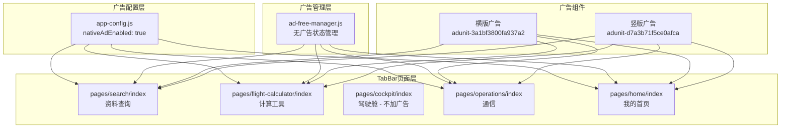

# Design Document: Native Ad Enhancement

## Overview

本设计文档描述了 FlightToolbox 小程序原生模板广告增强的技术实现方案。主要目标是在4个TabBar页面（资料查询、计算工具、通信、我的首页）增加原生模板广告，包括横版广告和竖版卡片式广告。

## Architecture



## Components and Interfaces

### 1. 广告位ID配置

使用现有已申请的广告位，无需重新申请：

| 广告类型 | 广告位 ID | 用途 |
|---------|----------|------|
| 横版原生模板 | `adunit-3a1bf3800fa937a2` | 顶部特殊卡片下方 |
| 竖版原生模板 | `adunit-d7a3b71f5ce0afca` | 卡片网格第3位置 |

### 2. 页面布局结构

#### 2.1 资料查询页面 (pages/search/index)

改造后结构：
```
┌─────────────────────────────┐
│  激励视频卡片（支持作者）     │
└─────────────────────────────┘
┌─────────────────────────────┐
│  【新增】横版广告            │  ← 位置1
└─────────────────────────────┘
┌──────────┐  ┌──────────┐
│  卡片1   │  │  卡片2   │
└──────────┘  └──────────┘
┌──────────┐  ┌──────────┐
│【竖版广告】│  │  卡片3   │      ← 位置2：第3格
└──────────┘  └──────────┘
┌──────────┐  ┌──────────┐
│  卡片4   │  │  卡片5   │
└──────────┘  └──────────┘
     ...
```

#### 2.2 计算工具页面 (pages/flight-calculator/index)

改造后结构：
```
┌─────────────────────────────┐
│  机场打卡卡片                │
└─────────────────────────────┘
┌─────────────────────────────┐
│  【新增】横版广告            │  ← 位置1
└─────────────────────────────┘
┌──────────┐  ┌──────────┐
│  卡片1   │  │  卡片2   │
└──────────┘  └──────────┘
┌──────────┐  ┌──────────┐
│【竖版广告】│  │  卡片3   │      ← 位置2
└──────────┘  └──────────┘
     ...
```

#### 2.3 通信页面 (pages/operations/index)

改造后结构：
```
┌─────────────────────────────┐
│  随机航线录音播放器卡片       │
└─────────────────────────────┘
┌─────────────────────────────┐
│  【新增】横版广告            │  ← 位置1
└─────────────────────────────┘
┌──────────┐  ┌──────────┐
│  航线录音 │  │  陆空通话 │
└──────────┘  └──────────┘
┌──────────┐  ┌──────────┐
│【竖版广告】│  │ CPDLC电文│      ← 位置2：第3格
└──────────┘  └──────────┘
┌──────────┐  ┌──────────┐
│  通信失效 │  │紧急改变高度│
└──────────┘  └──────────┘
```

#### 2.4 我的首页 (pages/home/index)

改造后结构：
```
┌─────────────────────────────┐
│  用户状态卡片（等级/经验）    │
└─────────────────────────────┘
┌─────────────────────────────┐
│  【新增】横版广告            │  ← 位置1
└─────────────────────────────┘
┌─────────────────────────────┐
│  资质提醒卡片                │
└─────────────────────────────┘
┌──────────┐  ┌──────────┐
│执勤期计算器│  │ 个人检查单│
└──────────┘  └──────────┘
┌──────────┐  ┌──────────┐
│【竖版广告】│  │ 长航线换班│      ← 位置2：第3格
└──────────┘  └──────────┘
     ...
```

### 3. WXML 广告组件模板

#### 3.1 横版广告组件

```xml
<!-- 横版广告 - 特殊卡片下方 -->
<view wx:if="{{ !isAdFree && nativeAdEnabled }}" class="ad-horizontal-container">
  <ad unit-id="adunit-3a1bf3800fa937a2" ad-type="banner" ad-intervals="30"></ad>
</view>
```

#### 3.2 竖版广告组件（卡片网格内）

```xml
<!-- 竖版广告 - 第3个位置 -->
<view wx:if="{{ index === 2 && !isAdFree && nativeAdEnabled }}" class="category-card ad-card-vertical">
  <ad unit-id="adunit-d7a3b71f5ce0afca" ad-type="banner" ad-intervals="30"></ad>
</view>
```

### 4. 样式定义

#### 4.1 横版广告容器样式

```css
/* 横版广告容器 */
.ad-horizontal-container {
  margin: 16rpx 24rpx 8rpx;
  border-radius: 20rpx;
  overflow: hidden;
  background: #FFFFFF;
  box-shadow: 
    0 2rpx 16rpx rgba(0, 0, 0, 0.04),
    0 0rpx 2rpx rgba(0, 0, 0, 0.02);
}

.ad-horizontal-container ad {
  width: 100%;
}
```

#### 4.2 竖版广告卡片样式

```css
/* 竖版广告卡片 - 融入卡片网格 */
.ad-card-vertical {
  background: #FFFFFF;
  border-radius: 28rpx;
  overflow: hidden;
  min-height: 320rpx;
  display: flex;
  align-items: center;
  justify-content: center;
  box-shadow: 
    0 2rpx 16rpx rgba(0, 0, 0, 0.04),
    0 0rpx 2rpx rgba(0, 0, 0, 0.02);
}

.ad-card-vertical ad {
  width: 100%;
  height: 100%;
}
```

## Data Models

### 页面数据模型

```javascript
Page({
  data: {
    isAdFree: false,           // 是否处于无广告状态
    nativeAdEnabled: false     // 原生模板广告总开关
  }
});
```

### 广告显示条件

```javascript
// 显示广告的条件
const shouldShowAd = !isAdFree && nativeAdEnabled;
```

## Correctness Properties

*A property is a characteristic or behavior that should hold true across all valid executions of a system-essentially, a formal statement about what the system should do. Properties serve as the bridge between human-readable specifications and machine-verifiable correctness guarantees.*

### Property 1: 广告显示控制

*For any* 页面状态组合（isAdFree, nativeAdEnabled），广告组件应该仅在 `!isAdFree && nativeAdEnabled` 为 true 时渲染，否则不渲染。

**Validates: Requirements 1.5, 5.2, 5.3, 6.2**

### Property 2: 卡片网格布局一致性

*For any* 卡片网格，当广告显示时，竖版广告应该位于第3个位置（index=2），原第3个卡片应该后移至第4位置；当广告隐藏时，卡片应该自动回流，无空白区域。

**Validates: Requirements 1.3, 1.6, 2.3, 2.6, 3.3, 3.6, 4.3, 4.6**

### Property 3: 无广告状态过期恢复

*For any* 无广告状态，当1小时有效期过期后，用户下次进入页面时 `isAdFree` 应该返回 false，广告应该恢复显示。

**Validates: Requirements 6.3**

## Error Handling

1. **广告加载失败**：微信 `<ad>` 组件在加载失败时会自动隐藏，不会显示空白区域，无需额外处理
2. **配置读取失败**：使用默认值（广告关闭状态）
3. **边界情况**：如果卡片数组长度小于3，竖版广告不会显示（因为 `index === 2` 条件不满足），这是预期行为

## Testing Strategy

### 单元测试

1. 测试广告显示条件逻辑
2. 测试配置开关的效果
3. 测试无广告状态的判断

### 集成测试

1. 测试页面加载时广告配置的正确读取
2. 测试无广告状态与广告隐藏的联动
3. 测试卡片网格在广告显示/隐藏时的布局变化

### 手动测试

1. 验证4个TabBar页面的广告位置正确
2. 验证广告样式与普通卡片一致
3. 验证观看激励视频后广告隐藏
4. 验证驾驶舱页面没有新增广告
