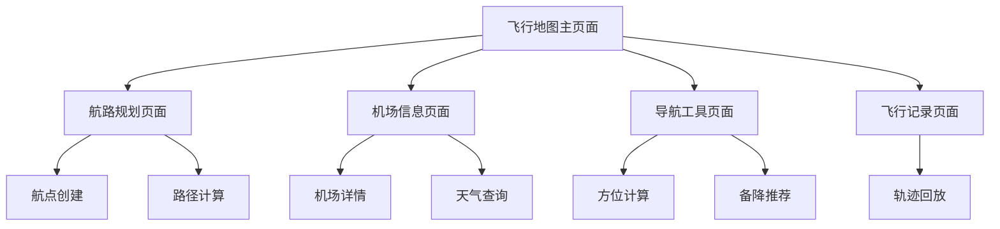

## 1. 产品概述

飞行专业地图页面是FlightToolbox中专为飞行员设计的高级地图功能，提供航路规划、机场信息查询、导航辅助和飞行态势感知等专业功能。该页面必须支持完全离线运行，确保飞行员在空中飞行模式下正常使用所有核心功能。

## 2. 核心功能

### 2.1 用户角色

| 角色 | 注册方式 | 核心权限 |
|------|----------|----------|
| 默认用户 | 无需注册，直接使用 | 可使用所有地图功能、航路规划、机场查询等完整功能 |

### 2.2 功能模块

我们的飞行专业地图需求包含以下核心页面：

1. **飞行地图主页面**：地图显示、图层控制、位置追踪、缩放控制
2. **航路规划页面**：航点创建、航路编辑、距离计算、燃油估算
3. **机场信息页面**：机场详情、跑道信息、频率查询、天气显示
4. **导航工具页面**：方位计算、交叉定位、备降机场推荐
5. **飞行记录页面**：航迹记录、飞行统计、轨迹回放

### 2.3 页面详情

| 页面名称 | 模块名称 | 功能描述 |
|----------|----------|----------|
| 飞行地图主页面 | 地图显示引擎 | 显示高精度地图，支持普通/卫星/航图三种模式切换，实时GPS定位显示 |
| 飞行地图主页面 | 图层管理系统 | 控制机场、航路、禁飞区、气象等图层的显示/隐藏，支持透明度调节 |
| 飞行地图主页面 | 位置追踪模块 | 实时显示飞机位置、航向、速度，支持航迹绘制和位置历史记录 |
| 飞行地图主页面 | 缩放控制器 | 提供多级缩放控制，显示比例尺，支持手势缩放和按钮缩放 |
| 航路规划页面 | 航点管理器 | 创建、编辑、删除航点，支持ICAO代码输入和地图点击创建 |
| 航路规划页面 | 航路计算引擎 | 计算航路总距离、各航段距离和航向，估算飞行时间和燃油消耗 |
| 航路规划页面 | 路径优化工具 | 提供直线航路和避障航路选择，自动规避禁飞区域 |
| 机场信息页面 | 机场数据库 | 显示机场基本信息、跑道数据、标高、坐标等详细资料 |
| 机场信息页面 | 频率查询系统 | 提供塔台、进近、地面等各类频率信息，支持一键复制 |
| 机场信息页面 | 天气信息模块 | 显示机场天气状况、风向风速、能见度等气象数据（离线模式显示缓存数据） |
| 导航工具页面 | 方位计算器 | 计算两点间距离、航向，支持大圆航线和等角航线计算 |
| 导航工具页面 | 交叉定位工具 | 通过多个导航台进行位置交叉定位，提高定位精度 |
| 导航工具页面 | 备降推荐系统 | 根据当前位置和燃油状况推荐最近的备降机场 |
| 飞行记录页面 | 航迹记录器 | 自动记录飞行轨迹，支持手动开始/停止记录 |
| 飞行记录页面 | 统计分析模块 | 显示飞行时间、距离、最高速度等统计数据 |
| 飞行记录页面 | 轨迹回放器 | 回放历史飞行轨迹，支持速度调节和关键点标注 |

## 3. 核心流程

**主要用户操作流程：**

用户进入飞行地图主页面，可以查看当前位置和周边机场信息。通过图层控制选择需要显示的信息类型。点击航路规划进入规划页面，创建航点并生成飞行计划。在机场信息页面查询目标机场的详细资料和天气状况。使用导航工具进行飞行中的导航计算。飞行记录页面可以查看和管理历史飞行数据。

## 4. 用户界面设计

### 4.1 设计风格

- **主色调**：深蓝色 (#1a365d) 和航空蓝 (#2563eb)，辅助色为橙色 (#f59e0b) 用于警告和重要信息
- **按钮样式**：圆角矩形按钮，支持触觉反馈，重要操作使用渐变效果
- **字体规范**：主要文字使用 28rpx，标题使用 32rpx，小字使用 24rpx，确保在驾驶舱环境下清晰可读
- **布局风格**：采用卡片式布局，顶部固定导航栏，底部工具栏，主要内容区域可滚动
- **图标风格**：使用航空主题的线性图标，支持夜间模式的高对比度显示

### 4.2 页面设计概览

| 页面名称 | 模块名称 | UI元素 |
|----------|----------|--------|
| 飞行地图主页面 | 顶部工具栏 | 深色半透明背景，包含搜索框、图层按钮、设置按钮，使用毛玻璃效果 |
| 飞行地图主页面 | 地图容器 | 全屏地图显示，支持手势操作，右下角显示比例尺和指北针 |
| 飞行地图主页面 | 底部控制栏 | 固定在底部，包含位置按钮、缩放控制、航路按钮等，使用航空蓝背景 |
| 航路规划页面 | 航点列表 | 卡片式布局，每个航点显示名称、坐标、距离，支持拖拽排序 |
| 航路规划页面 | 计算结果面板 | 显示总距离、飞行时间、燃油消耗，使用突出的橙色边框 |
| 机场信息页面 | 信息卡片 | 分组显示基本信息、跑道数据、频率信息，使用白色卡片配深色文字 |
| 机场信息页面 | 天气模块 | 独立的天气卡片，使用图标和颜色表示天气状况 |
| 导航工具页面 | 计算器界面 | 简洁的输入框和结果显示，使用大号字体确保易读性 |
| 飞行记录页面 | 记录列表 | 时间线式布局，显示飞行日期、时长、距离，支持展开查看详情 |

### 4.3 响应式设计

产品采用移动端优先设计，完全适配微信小程序环境。所有尺寸使用rpx单位确保在不同设备上的一致性。界面针对触摸操作优化，按钮和可点击区域不小于88rpx，确保在飞行手套环境下也能准确操作。支持横屏和竖屏两种模式，横屏时优化地