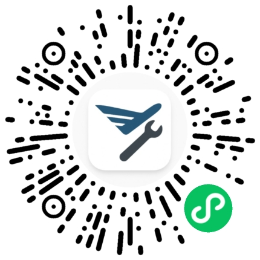

# 飞行工具箱 FlightToolbox

专为航线飞行员设计的微信小程序，提供离线可用的飞行工具、参考资料和实用功能。

## ✈️ 核心特性

- **离线优先**：所有功能在飞行模式下均可使用
- **专业工具**：飞行计算器、参考数据、通信辅助
- **海量数据**：30万+条记录，涵盖 ICAO 词汇、机场数据、CCAR 规章

## 🛠️ 主要功能

| 功能 | 说明 |
|------|------|
| 飞行计算器 | 下降率、侧风、转弯半径等计算 |
| 全球机场库 | 8,000+ 个机场数据（自动同步更新） |
| 航线录音 | 31 个国家/地区，338+ 条 ATC 通话录音 |
| CCAR 规章 | 1,447 份民航规章文档 |
| A330 绕机检查 | 带图片的外部检查指南 |
| GPS 驾驶舱 | 含欺骗检测的定位显示 |
| 资质管理 | 飞行员证照到期提醒 |
| 执勤期计算 | P章值勤时间限制查询 |

## 📱 使用方式

微信扫码体验：



或在微信中搜索「飞行工具箱」

## 🔧 开发环境

- **平台**：微信小程序
- **框架**：glass-easel 组件框架
- **语言**：JavaScript (ES5) + TypeScript
- **UI 组件**：Vant Weapp ^1.11.7
- **基础库**：3.10.0+

### 本地开发

```bash
# 安装依赖
cd miniprogram && npm install

# 在微信开发者工具中构建 npm
# 菜单：工具 -> 构建npm

# 修复 Vant 字体路径
npm run fix-fonts
```

### 项目结构

```
miniprogram/
├── pages/          # 主包页面（TabBar 5个）
├── package*/       # 分包（共59个）
├── utils/          # 工具类
├── data/           # 共享数据
├── components/     # 自定义组件
└── app.json        # 应用配置
```

## 📋 版本信息

当前版本：v3.0.0

查看 [更新说明](更新说明/版本更新说明样例.md) 了解版本历史。

## 👨‍✈️ 目标用户

- 商业航线飞行员（主要为中国航司）
- 飞行学员和教员

## ⚠️ 免责声明

本小程序旨在帮助飞行员学习航空理论知识，所有计算逻辑均基于作者个人理解编写，可能存在错误且未经官方验证。**所有数据仅供学习参考，严禁用于实际飞行操作！**

## 📞 联系作者

- 微信：wwingzero
- 公众号：飞行播客

## 📄 License

All Rights Reserved © 2024-2026 wangwingzero

本项目代码及相关资料仅供学习参考，未经作者书面许可，不得复制、修改、分发或用于商业用途。
