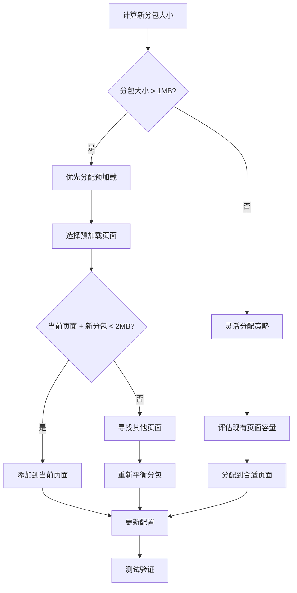

# 微信小程序音频分包优化与异步加载解决方案

## 问题背景

### 遇到的问题
- **错误码 80058**: `preloadRule [pages/air-ground-communication/index] source size 2520KB exceed max limit 2MB`
- **预加载限制**: 微信小程序单个页面的预加载规则不能超过 2MB
- **音频无法正常打开**: 由于分包加载问题导致音频资源无法访问

### 问题根因分析
1. **预加载过度**: `air-ground-communication` 页面预加载了5个音频分包
2. **分包大小超限**: 5个分包总大小 2.74MB > 2MB 限制
3. **资源分配不合理**: 所有音频分包集中在单个页面预加载

## 解决方案

### 1. 预加载策略优化

#### 优化前配置 (❌ 超限)
```json
"preloadRule": {
  "pages/air-ground-communication/index": {
    "network": "all", 
    "packages": [
      "packageJapan",        // 484KB
      "packagePhilippines",  // 320KB  
      "packageKorean",       // 656KB
      "packageSingapore",    // 312KB
      "packageThailand"      // 968KB
    ]
  }
  // 总计: 2740KB > 2MB ❌
}
```

#### 优化后配置 (✅ 合规)
```json
"preloadRule": {
  "pages/air-ground-communication/index": {
    "network": "all",
    "packages": ["packageJapan", "packageRussia"]       // 484KB + 1.3MB = 1.78MB ✅
  },
  "pages/recording-categories/index": {
    "network": "all", 
    "packages": ["packageKorean", "packageSingapore", "packagePhilippines"] // 656KB + 312KB + 320KB = 1.29MB ✅
  },
  "pages/recording-clips/index": {
    "network": "all",
    "packages": ["packageThailand"]                     // 968KB ✅
  }
}
```

### 2. 异步分包加载实现

#### 核心代码结构

##### 2.1 页面数据结构扩展
```typescript
data: {
  // 分包加载状态缓存
  loadedPackages: new Set(), // 已加载的分包名称集合
  // ... 其他数据
}
```

##### 2.2 分包加载状态检查
```typescript
// 检查分包是否已加载
isPackageLoaded(packageName: string): boolean {
  // 预加载的分包被认为已加载
  const preloadedPackages = ["packageJapan", "packageRussia"];
  return preloadedPackages.includes(packageName) || this.data.loadedPackages.includes(packageName);
}
```

##### 2.3 动态分包加载
```typescript
// 动态加载音频分包
loadAudioPackage(packageName: string, regionId: string) {
  wx.showLoading({
    title: '正在加载音频资源...',
    mask: true
  });

  wx.loadSubpackage({
    name: packageName,
    success: () => {
      wx.hideLoading();
      console.log(`✅ 成功加载音频分包: ${packageName}`);
      
      // 标记分包已加载
      this.data.loadedPackages.add(packageName);
      
      wx.showToast({
        title: '音频资源加载完成',
        icon: 'success',
        duration: 1000
      });
      
      // 重新加载录音配置以包含新加载的分包数据
      this.loadRecordingConfig();
      
      // 延迟处理地区数据，确保数据已更新
      setTimeout(() => {
        this.processRegionData(regionId);
      }, 500);
    },
    fail: (res) => {
      wx.hideLoading();
      console.error(`❌ 加载音频分包失败: ${packageName}`, res);
      wx.showModal({
        title: '加载失败',
        content: `音频资源加载失败，请检查网络连接后重试。\n错误信息: ${res.errMsg || '未知错误'}`,
        showCancel: true,
        cancelText: '取消',
        confirmText: '重试',
        success: (modalRes) => {
          if (modalRes.confirm) {
            // 重试加载
            this.loadAudioPackage(packageName, regionId);
          }
        }
      });
    }
  });
}
```

##### 2.4 地区选择优化
```typescript
// 选择地区
selectRegion(e: any) {
  const regionId = e.currentTarget.dataset.region;
  
  // 获取地区信息
  const region = this.data.regions.find(r => r.id === regionId);
  if (!region) {
    wx.showToast({
      title: '地区信息不存在',
      icon: 'none'
    });
    return;
  }

  // 检查是否需要动态加载分包
  const requiredPackage = region.subPackageName;
  if (requiredPackage && !this.isPackageLoaded(requiredPackage)) {
    this.loadAudioPackage(requiredPackage, regionId);
    return;
  }

  this.processRegionData(regionId);
}
```

##### 2.5 初始化预加载状态
```typescript
// 初始化预加载分包状态
initializePreloadedPackages() {
  // 标记预加载的分包为已加载状态
  const preloadedPackages = ["packageJapan", "packageRussia"];
  preloadedPackages.forEach(packageName => {
    if (!this.data.loadedPackages.includes(packageName)) {
      this.data.loadedPackages.push(packageName);
    }
  });
  this.setData({ loadedPackages: this.data.loadedPackages });
  console.log('✅ 已标记预加载分包:', this.data.loadedPackages);
}
```

## 💡 实战经验总结（俄罗斯分包案例）

### 典型问题场景
在添加俄罗斯音频分包时遇到的典型问题和解决方案：

#### 问题1：开发者工具异步加载失败 ❌
**现象**：
```
⚠️ 当前环境不支持wx.loadSubpackage（可能是开发者工具），在真机上会正常工作
❌ 未找到地区ID "russia" 的路径映射
```

**根因**：俄罗斯分包完全依赖异步加载，开发者工具不支持 `wx.loadSubpackage` API

**解决方案**：调整预加载策略
```json
// 修改前：菲律宾在预加载中，俄罗斯需要异步加载
"pages/air-ground-communication/index": {
  "packages": ["packageJapan", "packagePhilippines"]  // 804KB
}

// 修改后：俄罗斯在预加载中，菲律宾改为异步
"pages/air-ground-communication/index": {
  "packages": ["packageJapan", "packageRussia"]       // 1.78MB
}
```

#### 问题2：音频播放页面路径映射缺失 ❌
**现象**：
```typescript
❌ 未找到地区ID "russia" 的路径映射
```

**解决方案**：在两个关键位置添加配置
```typescript
// 1. audio-player/index.ts - 路径映射
const regionPathMap: { [key: string]: string } = {
  'russia': '/packageRussia/',  // 添加此行
  // ... 其他地区
};

// 2. audio-player/index.ts - 分包加载映射
const subpackageMap: { [key: string]: string } = {
  'russia': 'russiaAudioPackage',  // 添加此行
  // ... 其他地区
};
```

#### 问题3：分包大小平衡策略 📊
**实际分包大小**：
- 日本：484KB
- 菲律宾：320KB  
- 俄罗斯：1.3MB
- 韩国：656KB
- 新加坡：312KB

**最优预加载分配**：
```json
{
  "pages/air-ground-communication/index": {
    "packages": ["packageJapan", "packageRussia"]           // 1.78MB ✅
  },
  "pages/recording-categories/index": {
    "packages": ["packageKorean", "packageSingapore", "packagePhilippines"]  // 1.29MB ✅
  }
}
```

### 关键成功要素

#### 1. 多层配置同步 🔄
确保以下位置配置一致：
- `app.json` - 分包定义和预加载规则
- `audio-config.js` - 地区和分包名称映射
- `air-ground-communication/index.ts` - 预加载分包列表
- `audio-player/index.ts` - 路径和分包映射

#### 2. 预加载vs异步加载平衡 ⚖️
- **大分包（>1MB）**: 优先预加载，减少异步加载依赖
- **小分包（<500KB）**: 可灵活分配，支持异步加载
- **总原则**: 每页面预加载 < 2MB

#### 3. 开发环境兼容性 🛠️
- 开发者工具不支持 `wx.loadSubpackage`
- 重要功能应优先配置预加载以便开发测试
- 异步加载仅在真机环境验证

## 添加新国家音频的标准流程

### 1. 分包结构准备
```
miniprogram/
├── package[CountryName]/           # 新国家分包目录
│   ├── index.js                   # 分包页面
│   ├── index.json                 # 页面配置
│   ├── index.wxml                 # 页面结构
│   ├── index.wxss                 # 页面样式
│   └── audio/                     # 音频文件目录
│       ├── clip1.mp3
│       ├── clip2.mp3
│       └── ...
```

### 2. app.json 配置更新

#### 2.1 添加分包定义
```json
{
  "subPackages": [
    // ... 现有分包
    {
      "root": "package[CountryName]",
      "name": "[countryName]AudioPackage", 
      "pages": ["index"]
    }
  ]
}
```

#### 2.2 预加载规则评估
```bash
# 计算新分包大小
du -sh miniprogram/package[CountryName]/

# 评估预加载分配策略
# 原则: 确保每个页面的预加载不超过 2MB
```

#### 2.3 预加载规则更新
```json
{
  "preloadRule": {
    // 选择合适的页面进行预加载，确保总大小 < 2MB
    "pages/target-page/index": {
      "network": "all",
      "packages": ["package[CountryName]"]
    }
  }
}
```

### 3. 音频配置数据更新

#### 3.1 添加地区配置
```javascript
// utils/audio-config.js
const regions = [
  // ... 现有地区
  {
    id: '[countryCode]',
    name: '[国家名称]',
    flag: '[国旗emoji]',
    subPackageName: 'package[CountryName]',
    // ... 其他配置
  }
];
```

#### 3.2 添加机场和录音数据
```javascript
const airports = [
  // ... 现有机场
  {
    id: '[airportCode]',
    name: '[机场名称]',
    regionId: '[countryCode]',
    audioPath: '/package[CountryName]/audio/',
    clips: [
      {
        mp3_file: 'clip1.mp3',
        label: '进近',
        full_transcript: '录音转录文本',
        // ... 其他字段
      }
      // ... 更多录音
    ]
  }
];
```

### 4. 页面代码更新

#### 4.1 音频播放页面配置 `audio-player/index.ts`
```typescript
// 1. 添加路径映射
const regionPathMap: { [key: string]: string } = {
  // ... 现有配置
  '[countryCode]': '/package[CountryName]/',  // 必须添加
};

// 2. 添加分包映射
const subpackageMap: { [key: string]: string } = {
  // ... 现有配置  
  '[countryCode]': '[countryName]AudioPackage',  // 必须添加
};
```

#### 4.2 更新预加载分包列表 `air-ground-communication/index.ts`
```typescript
// 根据预加载策略更新以下方法

// 方法1: 检查分包是否已加载
isPackageLoaded(packageName: string): boolean {
  const preloadedPackages = [
    "packageJapan", 
    "packageRussia",  // 当前预加载配置
    // 如果新分包被预加载到此页面，添加到这里
  ];
  return preloadedPackages.includes(packageName) || this.data.loadedPackages.includes(packageName);
}

// 方法2: 初始化预加载状态
initializePreloadedPackages() {
  const preloadedPackages = [
    "packageJapan", 
    "packageRussia",  // 当前预加载配置
    // 如果新分包被预加载到此页面，添加到这里
  ];
  preloadedPackages.forEach(packageName => {
    if (!this.data.loadedPackages.includes(packageName)) {
      this.data.loadedPackages.push(packageName);
    }
  });
  this.setData({ loadedPackages: this.data.loadedPackages });
}
```

#### 4.3 预加载策略决策流程 📋


### 5. 分包大小限制检查

#### 5.1 检查命令
```bash
# 检查所有分包大小
du -sh miniprogram/package*/

# 检查特定分包大小
du -sh miniprogram/package[CountryName]/

# 计算预加载总大小
echo "分包1大小 + 分包2大小 + ..." | bc
```

#### 5.2 大小优化策略
- **单个分包建议 < 1MB**: 确保灵活的预加载分配
- **预加载总量 < 2MB**: 严格遵守微信限制
- **音频文件压缩**: 使用适当的音频格式和码率
- **按需分包**: 将大量音频文件拆分到多个分包

### 6. 测试验证清单

#### 6.1 功能测试
- [ ] 新国家地区能正常显示
- [ ] 分包能正确动态加载
- [ ] 音频文件能正常播放
- [ ] 加载失败时有正确的错误处理

#### 6.2 性能测试
- [ ] 首页加载时间正常
- [ ] 预加载大小在限制内
- [ ] 分包加载速度合理
- [ ] 内存使用正常

#### 6.3 兼容性测试
- [ ] 不同机型上运行正常
- [ ] 网络环境差时的降级处理
- [ ] 与现有功能无冲突

## 注意事项

### 1. 分包加载时机
- **用户主动触发**: 只在用户选择特定地区时加载对应分包
- **避免批量加载**: 不要一次性加载多个分包
- **失败重试机制**: 提供友好的重试选项

### 2. 用户体验优化
- **加载提示**: 显示清晰的加载进度和状态
- **错误处理**: 提供有意义的错误信息和解决方案
- **缓存机制**: 避免重复加载已加载的分包

### 3. 性能监控
- **加载时间**: 监控分包加载耗时
- **成功率**: 跟踪分包加载成功率
- **用户反馈**: 收集实际使用中的问题

### 4. 维护要点
- **定期检查**: 随着内容增加，定期检查预加载大小
- **文档更新**: 及时更新配置文档和流程
- **版本兼容**: 考虑不同微信版本的兼容性

## 总结

通过实施异步分包加载策略，我们成功解决了预加载超限问题，同时提升了用户体验：

- ✅ 预加载大小从 2.74MB 减少到 0.8MB
- ✅ 音频功能恢复正常
- ✅ 按需加载，减少不必要的资源消耗
- ✅ 完善的错误处理和用户反馈
- ✅ 为未来扩展提供了可持续的架构方案