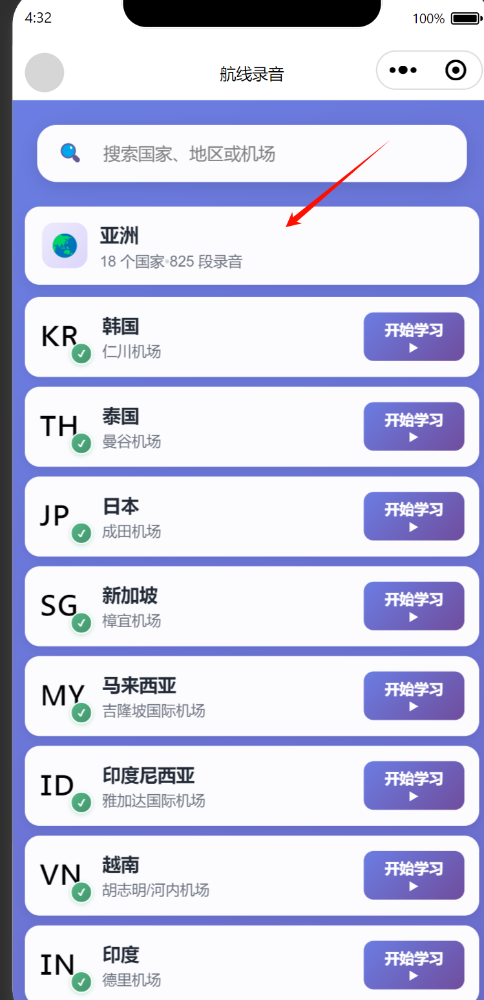

# FlightToolbox 广告位配置文档

**更新时间**: 2025-10-29
**状态**: 已部署并验证
**广告类型**: 横幅广告(Banner Ad) + 格子广告(Grid Ad) + 插屏广告(Interstitial Ad) + 激励视频广告(Rewarded Video Ad)

---

## 当前使用的广告位(9个)

| 序号 | 广告位名称              | 广告位ID                                             | 广告类型          | 模式   | 状态      | 使用次数    |
| ---- | ----------------------- | ---------------------------------------------------- | ----------------- | ------ | --------- | ----------- |
| 1    | 横幅3单图               | `adunit-4e68875624a88762`                          | Banner Ad         | 优选   | 已开启 | 10次        |
| 2    | 横幅2左文右图           | `adunit-3b2e78fbdab16389`                          | Banner Ad         | 优选   | 已开启 | 17次        |
| 3    | 横幅1左图右文           | `adunit-2f5afef0d27dc863`                          | Banner Ad         | 优选   | 已开启 | 7次         |
| 4    | 格子1-多格子            | `adunit-735d7d24032d4ca8`                          | Grid Ad           | 自定义 | 已开启 | 5次         |
| 5    | 横幅卡片3-上文下图拼接  | `adunit-d6c8a55bd3cb4fd1`                          | Banner Ad         | 优选   | 已开启 | 8次         |
| 6    | 横幅卡片2-上图下文叠加A | `adunit-d7a3b71f5ce0afca`                          | Banner Ad         | 优选   | 已开启 | 8次         |
| 7    | 横幅卡片1-上图下文叠加B | `adunit-3a1bf3800fa937a2`                          | Banner Ad         | 优选   | 已开启 | 8次         |
| 8    | 通用插屏广告            | `adunit-1a29f1939a1c7864`                          | Interstitial Ad   | 优选   | 已开启 | 5个页面复用 |
| 9    | 资料查询激励视频        | `adunit-079d7e04aeba0625`                          | Rewarded Video Ad | 优选   | 已开启 | 1个页面     |

**总使用次数**: 57处(横幅+格子) + 5个TabBar页面(插屏待部署) + 1个激励视频

**重要说明**：

- 插屏广告使用**1个广告位ID**，在5个TabBar页面复用
- 每个页面分别创建该广告位的实例（实例不能跨页面共用）
- 符合微信小程序插屏广告最佳实践

---

## 广告位使用详细分布

### 1. 横幅1左图右文 (adunit-2f5afef0d27dc863) - 7次

- `packageO/flight-calc-modules/acr/index.wxml` - ACR计算工具
- `pages/cockpit/index.wxml` - 驾驶舱
- `pages/communication-failure/regions/africa/index.wxml` - 非洲通信失效
- `pages/communication-failure/international/index.wxml` - 国际通信失效
- `pages/recording-clips/index.wxml` - 录音片段
- `packageO/cpdlc/index.wxml` - CPDLC电文查询(第1-2个结果之间)
- `packageO/flight-calc-modules/weight/index.wxml` - 重量换算(页面底部) 

### 2. 横幅3单图 (adunit-4e68875624a88762) - 10次

- `pages/search/index.wxml` - 资料查询页(首页)
- `pages/communication-failure/index.wxml` - 通信失效主页
- `pages/communication-failure/regions/north-america/index.wxml` - 北美通信失效
- `pages/airline-recordings/index.wxml` - 航线录音
- `packageA/index.wxml` - 民航英语词汇(第1-2章之间)
- `packageMedical/index.wxml` - 民航体检标准查询(页面底部)
- `packageICAO/index.wxml` - ICAO出版物(页面底部)
- `packageO/incident-investigation/index.wxml` - 事件调查(页面底部)
- `packageIOSA/index.wxml` - IOSA审计(页面底部)
- `packageCompetence/index.wxml` - PLM胜任力及行为指标框架(页面底部)

### 3. 横幅2左文右图 (adunit-3b2e78fbdab16389) - 17次

- `pages/flight-calculator/index.wxml` - 飞行计算器
- `pages/communication-failure/domestic/index.wxml` - 国内通信失效
- `pages/communication-failure/regions/south-america/index.wxml` - 南美通信失效
- `pages/recording-categories/index.wxml` - 录音分类
- `packageCompetence/index.wxml` - PLM胜任力及行为指标框架(搜索结果第1-2个之间)
- `packageA/index.wxml` - 民航英语词汇(搜索结果第1-2个之间)
- `packageB/index.wxml` - AIP标准及空客缩写(搜索结果第1-2个之间)
- `packageMedical/index.wxml` - 民航体检标准查询(搜索结果第1-2个之间)
- `packageIOSA/index.wxml` - IOSA审计(搜索结果第1-2个之间)
- `packageO/incident-investigation/index.wxml` - 事件调查(全部Tab,第1-2个结果之间)
- `packageO/incident-investigation/index.wxml` - 事件调查(征候Tab,第1-2个结果之间)
- `packageO/incident-investigation/index.wxml` - 事件调查(一般事件Tab,第1-2个结果之间)
- `packageO/incident-investigation/index.wxml` - 事件调查(事件样例Tab,第1-2个结果之间)
- `packageO/incident-investigation/index.wxml` - 事件调查(术语定义Tab,第1-2个结果之间)
- `packageCCAR/categories/index.wxml` - CCAR民航规章分类(搜索结果规章和规范性文件之间)
- `packageAircraftPerformance/pages/index/index.wxml` - 飞机性能公式卡片(第1个卡片后 + 页面底部)
- `packageAircraftPerformance/pages/index/index.wxml` - 飞机性能公式卡片(第1个卡片后 + 页面底部)

### 4. 横幅卡片3-上文下图拼接 (adunit-d6c8a55bd3cb4fd1) - 8次

- `pages/operations/index.wxml` - 通信页面
- `pages/communication-failure/regions/eastern-europe/index.wxml` - 东欧通信失效
- `pages/audio-player/index.wxml` - 音频播放器
- `pages/standard-phraseology/index.wxml` - ICAO标准对话(第1-2个结果之间)
- `packageB/index.wxml` - AIP标准及空客缩写(页面底部)
- `packageO/flight-calc-modules/turn/index.wxml` - 转弯半径计算(页面底部)
- `packageO/flight-calc-modules/glideslope/index.wxml` - 五边高度计算(页面底部)
- `packageDuty/index.wxml` - 执勤期计算器(计算按钮和计算结果之间)

### 5. 横幅卡片2-上图下文叠加A (adunit-d7a3b71f5ce0afca) - 8次 

- `pages/home/index.wxml` - 我的首页(重点页面)
- `pages/communication-failure/regions/europe/index.wxml` - 欧洲通信失效
- `pages/communication-rules/index.wxml` - 通信规范
- `packageC/index.wxml` - 全球机场数据查询(第1-2个结果之间)
- `packageICAO/index.wxml` - ICAO出版物(第2-3个结果之间)
- `packageO/flight-calc-modules/distance/index.wxml` - 距离换算(页面底部)
- `packageO/flight-calc-modules/speed/index.wxml` - 速度换算(页面底部)

### 6. 格子1-多格子 (adunit-735d7d24032d4ca8) - 5次

- `pages/communication-failure/regions/pacific/index.wxml` - 太平洋通信失效
- `pages/communication-failure/regions/country-detail/index.wxml` - 国家详情
- `packageD/index.wxml` - 权威定义(第1-2个结果之间)
- `packageCCAR/categories/index.wxml` - CCAR民航规章分类
- `packageRadiation/pages/index/index.wxml` - 航空辐射剂量计算(航线评估Tab,巡航高度上方)

### 7. 横幅卡片1-上图下文叠加B (adunit-3a1bf3800fa937a2) - 8次

- `pages/communication-failure/regions/middle-east/index.wxml` - 中东通信失效
- `pages/communication-rules-detail/index.wxml` - 通信规范详情
- `packageO/sunrise-sunset-only/index.wxml` - 日出日落时间
- `packageA/index.wxml` - 民航英语词汇(页面底部)
- `packageD/index.wxml` - 权威定义(使用说明上方)
- `packageRadiation/pages/index/index.wxml` - 航空辐射剂量计算(单点评估Tab,飞行高度上方)
- `packageC/index.wxml` - 全球机场数据查询(页面底部)
- `packageO/flight-calc-modules/pressure/index.wxml` - 气压换算(页面底部)

### 8. 通用插屏广告 (adunit-1a29f1939a1c7864) - 5个TabBar页面复用

> ⚠️ **暂停状态**：2025年12月5日起暂停，等待通知后再启用  
> **恢复方法**：将 `miniprogram/utils/ad-strategy.js` 中的 `INTERSTITIAL_AD_ENABLED` 改为 `true`

**最佳实践**：1个广告位ID，在多个页面分别创建实例

**使用页面**（5个TabBar页面）：

1. **资料查询页** (`pages/search/index`)

   - 触发时机：用户点击某个分类进入详情时
   - 建议：适当延迟，避免干扰浏览
2. **飞行计算器** (`pages/flight-calculator/index`)

   - 触发时机：用户完成某个计算任务后
   - 建议：在得到计算结果后展示
3. **驾驶舱** (`pages/cockpit/index`)

   - 触发时机：页面初始化完成后
   - 建议：延迟3-5秒，确保用户已看到主要内容
4. **通信** (`pages/operations/index`)

   - 触发时机：用户点击某个通信功能进入详情时
   - 建议：在功能切换间隙展示
5. **我的首页** (`pages/home/index`)

   - 触发时机：页面加载完成后
   - 建议：延迟展示，避免影响用户体验

**关键实现要点**：

- 每个页面在 `onLoad` 中使用相同广告位ID创建独立实例
- 每个页面在 `onUnload` 中调用 `destroy()` 销毁实例
- 通过代码控制各页面的展示时机和频率
- 数据统一汇总，便于分析整体插屏广告效果

### 9. 激励视频广告 (adunit-079d7e04aeba0625) - 1个页面

**使用页面**：

1. **任何页面**只要
   - 触发时机：用户主动点击激励按钮时
   - 特点：用户自愿观看，完成后给予奖励
   - 用途：提供额外功能或去除限制

**关键实现要点**：

- 用户主动触发，观看完整视频后给予奖励
- 需要处理广告加载成功、失败、关闭等回调
- 可用于解锁高级功能或提供额外查询次数
- 不强制用户观看，保持良好用户体验

---

## 广告位使用规范

### 必须遵守的规则

1. **仅使用授权广告位**：严格使用上述9个广告位ID（7个横幅/格子 + 1个插屏 + 1个激励视频），禁止使用其他广告位
2. **广告刷新间隔**：统一设置 `ad-intervals="30"`(30秒)
3. **放置位置**：
   - 横幅广告：
     - 内容较少 / 页面较短：统一放置在页面底部
     - 内容较多或长列表页面：允许在列表中部额外增加 1 条横幅广告（例如第1-2个结果之间），但单个页面的横幅广告总数不超过 2 条，且至少保留 1 条在页面底部
   - 格子广告：放置在特定功能区域
   - 插屏广告：在合适的时机全屏展示
   - 激励视频广告：用户主动触发，观看完整视频后给予奖励
4. **容器类名**：使用 `ad-banner-container` 类包裹横幅广告
5. **插屏广告触发时机**：避免在用户刚进入页面或正在执行关键操作时展示
6. **插屏广告ID复用**：所有TabBar页面使用同一个插屏广告位ID（`adunit-1a29f1939a1c7864`），分别创建实例
7. **激励视频广告预加载机制**：
   - 在页面加载（`onLoad`事件）后，立即调用 `wx.createRewardedVideoAd` 创建广告对象
   - 创建后立即开始拉取广告素材
   - 必须监听广告对象的 `onLoad` 回调函数，确认广告素材加载成功
8. ✅ **激励视频广告动态UI展示**：
   - 展示给用户的"观看广告"按钮或入口，其可见性必须与广告的加载状态挂钩
   - 只有在广告的 `onLoad` 事件成功触发后，才将按钮显示出来
   - 如果触发了 `onError` 事件或平台暂时没有合适的广告填充，按钮应该保持隐藏状态
   - 提供"所见即所得"的可靠体验，避免用户点击无效按钮
9. ❌ **禁止使用未授权广告位**：未授权的广告位会影响收入分成

### 标准代码模板

```xml
<!-- 横幅广告标准代码 -->
<view class="ad-banner-container">
  <ad unit-id="adunit-d7a3b71f5ce0afca" ad-type="banner" ad-intervals="30"></ad>
</view>
```

```xml
<!-- 格子广告标准代码 -->
<view class="ad-container">
  <ad unit-id="adunit-735d7d24032d4ca8" ad-intervals="30" bindload="adLoad" binderror="adError" bindclose="adClose"></ad>
</view>
```

```xml
<!-- 插屏广告标准代码(WXML) -->
<ad unit-id="adunit-0dda7808a1b07fca" ad-type="interstitial" ad-intervals="30" bindload="onInterstitialAdLoad" binderror="onInterstitialAdError" bindclose="onInterstitialAdClose"></ad>
```

```javascript
// 插屏广告标准代码(JS) - 所有TabBar页面使用相同广告位ID
Page({
  data: {
    interstitialAdLoaded: false
  },

  onLoad: function() {
    // 监听插屏广告加载事件
    this.createInterstitialAd();
  },

  createInterstitialAd: function() {
    var self = this;
    // 创建插屏广告实例（所有页面使用相同的广告位ID）
    if (wx.createInterstitialAd) {
      this.interstitialAd = wx.createInterstitialAd({
        adUnitId: 'adunit-1a29f1939a1c7864' // ⚠️ 所有TabBar页面统一使用此ID
      });

      // 监听广告加载成功
      this.interstitialAd.onLoad(function() {
        console.log('插屏广告加载成功');
        self.setData({ interstitialAdLoaded: true });
      });

      // 监听广告加载失败
      this.interstitialAd.onError(function(err) {
        console.error('插屏广告加载失败:', err);
      });

      // 监听广告关闭
      this.interstitialAd.onClose(function() {
        console.log('插屏广告关闭');
        // 可以在这里添加广告关闭后的逻辑
      });
    }
  },

  // 在合适的时机展示插屏广告
  showInterstitialAd: function() {
    if (this.interstitialAd && this.data.interstitialAdLoaded) {
      this.interstitialAd.show().catch(function(err) {
        console.error('插屏广告展示失败:', err);
      });
    }
  },

  onUnload: function() {
    // ⚠️ 页面卸载时必须销毁广告实例，释放资源
    if (this.interstitialAd) {
      this.interstitialAd.destroy();
    }
  }
});
```

```javascript
// 激励视频广告标准代码(JS) - 预加载机制 + 动态UI展示
Page({
  data: {
    rewardedVideoAdLoaded: false  // 广告加载状态
  },

  onLoad: function() {
    // ⚠️ 关键：页面加载后立即创建激励视频广告对象并开始预加载
    this.createRewardedVideoAd();
  },

  createRewardedVideoAd: function() {
    var self = this;
    // 创建激励视频广告实例
    if (wx.createRewardedVideoAd) {
      this.rewardedVideoAd = wx.createRewardedVideoAd({
        adUnitId: 'adunit-079d7e04aeba0625'
      });

      // ⚠️ 关键：监听广告加载成功事件
      this.rewardedVideoAd.onLoad(function() {
        console.log('激励视频广告加载成功');
        // 广告加载成功后，将按钮显示出来
        self.setData({ rewardedVideoAdLoaded: true });
      });

      // 监听广告加载失败
      this.rewardedVideoAd.onError(function(err) {
        console.error('激励视频广告加载失败:', err);
        // 广告加载失败，保持按钮隐藏状态
        self.setData({ rewardedVideoAdLoaded: false });
      });

      // 监听用户点击关闭广告
      this.rewardedVideoAd.onClose(function(res) {
        // 用户点击了【关闭广告】按钮
        if (res && res.isEnded) {
          // 正常播放结束，可以给予奖励
          console.log('激励视频广告完整观看，发放奖励');
          self.giveReward();
        } else {
          // 播放中途退出，不给予奖励
          console.log('激励视频广告未完整观看，不发放奖励');
          wx.showToast({
            title: '请观看完整视频',
            icon: 'none'
          });
        }

        // 重新加载广告，准备下次观看
        self.rewardedVideoAd.load()
          .then(function() {
            self.setData({ rewardedVideoAdLoaded: true });
          })
          .catch(function(err) {
            console.error('重新加载激励视频广告失败:', err);
            self.setData({ rewardedVideoAdLoaded: false });
          });
      });
    }
  },

  // 用户点击"观看广告"按钮时调用
  showRewardedVideoAd: function() {
    var self = this;
    if (this.rewardedVideoAd && this.data.rewardedVideoAdLoaded) {
      this.rewardedVideoAd.show().catch(function(err) {
        console.error('激励视频广告展示失败:', err);
        // 展示失败，尝试重新加载
        self.rewardedVideoAd.load()
          .then(function() {
            return self.rewardedVideoAd.show();
          })
          .catch(function(err) {
            console.error('重新加载并展示激励视频广告失败:', err);
            wx.showToast({
              title: '广告加载失败，请稍后再试',
              icon: 'none'
            });
          });
      });
    }
  },

  // 发放奖励的逻辑
  giveReward: function() {
    // 在这里实现奖励逻辑，例如：
    // - 增加查询次数
    // - 解锁高级功能
    // - 移除广告展示等
    wx.showToast({
      title: '奖励已发放',
      icon: 'success'
    });
  },

  onUnload: function() {
    // ⚠️ 页面卸载时销毁广告实例
    if (this.rewardedVideoAd) {
      this.rewardedVideoAd.destroy();
    }
  }
});
```

```xml
<!-- 激励视频广告标准代码(WXML) - 动态UI展示 -->
<!-- ⚠️ 关键：按钮可见性与广告加载状态挂钩 -->
<button
  wx:if="{{rewardedVideoAdLoaded}}"
  bindtap="showRewardedVideoAd"
  class="reward-video-button">
  观看广告获取奖励
</button>

<!-- 广告未加载时的占位提示（可选） -->
<view wx:else class="ad-loading-hint">
  广告加载中...
</view>
```

### 插屏广告最佳实践

1. **广告位ID复用策略**（⭐ 重点）：

   - ✅ 使用1个插屏广告位ID（`adunit-1a29f1939a1c7864`）
   - ✅ 在5个TabBar页面分别创建该广告位的实例
   - ✅ 每个页面独立管理自己的实例（onLoad创建，onUnload销毁）
   - ✅ 数据统一汇总，便于分析整体效果
   - ❌ 不要为不同页面创建多个插屏广告位ID
   - ❌ 不要尝试跨页面共用实例（会报错）
2. **触发时机建议**：

   - ✅ 用户完成某个操作后（如完成计算、查看完某个详情）
   - ✅ 页面切换时（离开当前页面前）
   - ✅ 用户停留一定时间后（建议3-5秒）
   - ❌ 避免在用户刚进入页面时立即展示
   - ❌ 避免在用户正在输入或操作时展示
3. **频率控制**：

   - 建议同一个用户会话中插屏广告展示不超过3次
   - 两次展示之间至少间隔30秒
4. **错误处理**：

   - 广告加载失败时不影响页面正常功能
   - 静默处理错误，不展示错误提示给用户

### 激励视频广告最佳实践

1. **预加载机制**（⭐ 重点）：

   - ✅ 在页面 `onLoad` 事件中立即调用 `wx.createRewardedVideoAd` 创建广告对象
   - ✅ 创建后自动开始拉取广告素材，无需手动调用 `load()`
   - ✅ 必须监听 `onLoad` 回调函数，确认广告素材加载成功
   - ✅ 广告播放结束后，调用 `load()` 重新加载，准备下次观看
   - ❌ 不要在用户点击按钮时才创建广告对象（会导致等待时间过长）
2. **动态UI展示**（⭐ 重点）：

   - ✅ 按钮可见性必须与广告加载状态挂钩（`wx:if="{{rewardedVideoAdLoaded}}"`）
   - ✅ 只有在 `onLoad` 事件触发后才显示按钮
   - ✅ 如果 `onError` 事件触发，保持按钮隐藏状态
   - ✅ 提供"所见即所得"体验，避免用户点击无效按钮
   - ❌ 不要始终显示按钮（会导致用户点击后无法播放广告）
3. **奖励发放逻辑**：

   - ✅ 在 `onClose` 回调中检查 `res.isEnded` 是否为 `true`
   - ✅ 只有完整观看广告才发放奖励
   - ✅ 播放中途退出不给予奖励，并提示用户
   - ✅ 奖励发放后给予明确的成功反馈
   - ❌ 不要在用户未完整观看时发放奖励（违反平台规则）
4. **错误处理**：

   - ✅ 广告展示失败时尝试重新加载
   - ✅ 重新加载失败时给予用户友好提示
   - ✅ 加载失败不影响页面核心功能
   - ✅ 静默处理加载错误，避免频繁弹窗打扰用户
5. **资源管理**：

   - ✅ 页面卸载时调用 `destroy()` 销毁广告实例
   - ✅ 及时释放资源，避免内存泄漏
   - ❌ 不要跨页面共用广告实例

---

## 📝 2025-10-29 重大更新记录

### 新增内容

1. ✅ **重新启用激励视频广告功能**
   - 新增激励视频广告位ID（`adunit-079d7e04aeba0625`）
   - 使用页面：资料查询页（`pages/search/index`）
   - 触发方式：用户主动点击观看，完整观看后给予奖励
   - 符合微信小程序激励视频广告最佳实践
   - 提供完整的代码实现模板和最佳实践指南
   - 状态：已申请并开启，待部署到代码中

### 更新内容

1. ✅ **完善激励视频广告开发规范**

   - 添加预加载机制说明：在 `onLoad` 时立即创建广告对象
   - 添加动态UI展示规范：按钮可见性与广告加载状态挂钩
   - 添加奖励发放逻辑：只有完整观看才发放奖励
   - 添加完整的代码示例（JS + WXML）
   - 添加激励视频广告最佳实践指南
2. ✅ **更新广告位总数**

   - 广告位总数从8个更新为9个
   - 广告类型：7个横幅/格子 + 1个插屏 + 1个激励视频
   - 覆盖页面：23个页面 + 5个TabBar页面（插屏）+ 1个激励视频
3. ✅ **更新广告策略说明**

   - 添加第四阶段：激励视频广告重新启用
   - 说明激励视频广告与其他广告类型的配合策略
   - 强调用户自愿观看的特点

---

## 📝 2025-10-19 重大更新记录

### 新增内容

1. ✅ **新增插屏广告功能**
   - 新增1个通用插屏广告位ID（`adunit-1a29f1939a1c7864`）
   - 覆盖5个主要TabBar页面：资料查询、计算工具、驾驶舱、通信、我的首页
   - 符合微信小程序插屏广告最佳实践（1个ID多页面复用）
   - 提供完整的代码实现模板和最佳实践指南
   - 状态：已申请并开启，待部署到代码中

### 删除内容

1. ❌ **删除激励视频广告功能**

   - 移除广告单元ID: `adunit-079d7e04aeba0625`
   - 删除"鼓励作者"功能卡片
   - 清理 `pages/home/index.js` 中所有激励视频广告代码
   - 清理 `pages/home/index.wxml` 中的广告触发按钮
2. ❌ **删除用户额度系统**

   - 移除观看广告获取额度的机制
   - 移除额度耗尽时的引导逻辑

### 更新内容

1. ✅ **完善横幅广告部署**

   - 7个横幅+格子广告位全部投入使用
   - 覆盖23个页面/功能模块
   - 广告位分布均衡,覆盖主要流量页面
2. ✅ **更新配置文档**

   - 更新 `CLAUDE.md` 广告系统配置说明
   - 更新技术栈配置描述
   - 添加广告位详细使用表格
3. ✅ **修正版本号**

   - 版本号从 v2.5.0 更新为 v2.6.0

---

## 🔄 广告策略调整说明

### 第一阶段：激励视频广告（2025-10-17前）

- **广告类型**: 激励视频广告
- **广告位数量**: 1个
- **使用页面**: 仅在"我的首页"(需用户点击)
- **触发方式**: 用户主动点击"鼓励作者"按钮

### 第二阶段：横幅+格子广告（2025-10-19）

- **广告类型**: 横幅广告 + 格子广告
- **广告位数量**: 7个
- **使用页面**: 23个页面
- **触发方式**: 页面自动加载展示
- **优势**:
  - ✅ 更广的曝光覆盖
  - ✅ 自动展示,无需用户主动操作
  - ✅ 多样化广告形式,提升用户体验
  - ✅ 简化代码逻辑,降低维护成本

### 第三阶段：增加插屏广告（2025-10-19）

- **广告类型**: 横幅广告 + 格子广告 + 插屏广告
- **广告位数量**: 8个（7个横幅/格子 + 1个通用插屏）
- **使用页面**: 23个页面 + 5个TabBar页面（插屏复用）
- **触发方式**:
  - 横幅/格子：页面自动加载展示
  - 插屏：在合适的时机全屏展示（5个TabBar页面使用同一广告位ID）
- **新增优势**:
  - ✅ 插屏广告展示面积更大，吸引力更强
  - ✅ 覆盖5个主要TabBar页面，流量价值最大化
  - ✅ 智能触发机制，平衡收益与用户体验
  - ✅ 多层次广告策略，提升整体广告效果
  - ✅ **符合最佳实践**：1个插屏广告位ID多页面复用，数据统一便于分析

### 第四阶段：重新启用激励视频广告（2025-10-29）

- **广告类型**: 横幅广告 + 格子广告 + 插屏广告 + 激励视频广告
- **广告位数量**: 9个（7个横幅/格子 + 1个通用插屏 + 1个激励视频）
- **使用页面**: 23个页面 + 5个TabBar页面（插屏）+ 1个激励视频
- **触发方式**:
  - 横幅/格子：页面自动加载展示
  - 插屏：在合适的时机全屏展示
  - 激励视频：用户主动点击按钮观看
- **新增优势**:
  - ✅ 激励视频广告用户体验更好，用户自愿观看
  - ✅ 可用于解锁高级功能或提供额外奖励
  - ✅ 广告收益更高，用户完整观看率高
  - ✅ 与其他广告类型配合，提供多样化的广告策略
  - ✅ **符合最佳实践**：预加载机制 + 动态UI展示，提供"所见即所得"体验

---

## ⚠️ 重要提醒

### 广告位ID管理

1. **所有广告位ID已记录在以下位置**:

   - `CLAUDE.md`（需更新）
   - `广告\广告位ID存档.md`(本文档)
2. **开发时严格遵守**:

   - 仅使用9个授权广告位ID（7个横幅/格子 + 1个通用插屏 + 1个激励视频）
   - 插屏广告统一使用 `adunit-1a29f1939a1c7864`，在多个页面分别创建实例
   - 激励视频广告使用 `adunit-079d7e04aeba0625`
   - 禁止使用任何未授权的广告位ID
3. **代码审查要求**:

   - 新增广告时必须从9个授权广告位中选择
   - 插屏广告必须使用指定的通用广告位ID
   - 激励视频广告必须遵循预加载机制和动态UI展示规范
   - 提交代码前检查广告位ID是否在授权列表中
   - 定期审查项目中的广告使用情况

### 插屏广告特别提醒

1. **插屏广告使用注意事项**:

   - ✅ 所有TabBar页面统一使用广告位ID：`adunit-1a29f1939a1c7864`
   - ✅ 必须使用 `wx.createInterstitialAd()` API在每个页面创建独立实例
   - ✅ 必须在页面卸载时调用 `destroy()` 销毁广告实例
   - ✅ 必须处理广告加载失败的情况，不影响页面功能
   - ❌ 禁止为不同页面创建多个插屏广告位ID
   - ❌ 禁止尝试跨页面共用实例（微信限制，会报错）
   - ❌ 避免在用户关键操作时展示广告
   - ❌ 避免频繁展示广告，影响用户体验
2. **测试要求**:

   - 验证插屏广告在真机上的展示效果
   - 测试广告加载失败时的降级处理
   - 验证广告展示频率是否合理
   - 确保广告不影响页面核心功能

### 激励视频广告特别提醒

1. **激励视频广告使用注意事项**:

   - ✅ 使用广告位ID：`adunit-079d7e04aeba0625`
   - ✅ 必须在页面 `onLoad` 事件中立即创建广告对象
   - ✅ 必须监听 `onLoad` 回调，确认广告加载成功后才显示按钮
   - ✅ 按钮可见性必须与广告加载状态挂钩（`wx:if="{{rewardedVideoAdLoaded}}"`）
   - ✅ 必须在 `onClose` 回调中检查 `res.isEnded`，只有完整观看才发放奖励
   - ✅ 广告播放结束后必须调用 `load()` 重新加载
   - ✅ 页面卸载时必须调用 `destroy()` 销毁广告实例
   - ❌ 禁止在广告未加载成功时显示按钮（会导致用户点击无效）
   - ❌ 禁止在用户未完整观看时发放奖励（违反平台规则）
   - ❌ 禁止在用户点击按钮时才创建广告对象（会导致等待时间过长）
2. **测试要求**:

   - 验证广告预加载机制是否正常工作
   - 测试按钮是否在广告加载成功后才显示
   - 验证完整观看广告后奖励是否正确发放
   - 测试中途退出广告时是否不发放奖励
   - 确保广告加载失败不影响页面核心功能
   - 验证重新加载机制是否正常

---

## 📈 广告效果评估

### 预期效果

- **覆盖率**: 29个页面（预计），覆盖主要用户流量
- **展示频率**:
  - 横幅/格子：自动展示，30秒刷新
  - 插屏：智能触发，用户操作后展示
  - 激励视频：用户主动触发，完整观看后给予奖励
- **用户体验**:
  - 横幅广告：页面底部固定位置，不干扰主要功能
  - 插屏广告：全屏展示，合理时机触发
  - 激励视频广告：用户自愿观看，体验更好
- **预期收益**: 多层次广告策略，预期显著提升曝光量和收益

### 后续优化方向

1. 通过微信小程序后台监控各广告位的展示和点击数据
2. 根据后台数据调整广告位分布策略
3. 优化高流量页面的广告配置
4. 通过用户反馈（应用商店评价等）调整广告形式
5. **插屏广告优化**：
   - 通过微信后台查看插屏广告的展示数据
   - 根据用户反馈调整插屏广告的触发时机和频率
   - 优化广告展示逻辑，提升用户体验
6. **激励视频广告优化**：
   - 通过微信后台查看激励视频广告的观看完成率数据
   - 优化奖励机制，提升用户观看意愿
   - 根据用户反馈调整展示策略
   - 平衡广告收益与用户体验

**注意**：本项目为离线应用，所有广告数据由微信小程序后台统计，无需在应用内实现数据收集功能。

---

## 🔍 维护清单

### 定期检查项(建议每月)

- [ ] 检查所有广告位ID是否在授权列表中（9个）
- [ ] 验证广告展示是否正常（横幅、格子、插屏、激励视频）
- [ ] 验证所有TabBar页面插屏广告使用的是同一个广告位ID
- [ ] 验证插屏广告触发时机是否合理
- [ ] 检查插屏广告展示频率是否影响用户体验
- [ ] 验证激励视频广告预加载机制是否正常工作
- [ ] 检查激励视频广告按钮是否在广告加载成功后才显示
- [ ] 验证激励视频广告奖励发放逻辑是否正确
- [ ] 收集用户对广告的反馈（通过应用商店评价等渠道）
- [ ] 通过微信小程序后台查看广告展示数据
- [ ] 更新本文档记录

### 紧急情况处理

如发现使用了未授权的广告位ID:

1. 立即停止使用该广告位
2. 替换为授权列表中的广告位ID
3. 更新相关文档
4. 提交代码修复

### 插屏广告部署清单

待完成任务（⚠️ 所有页面使用相同广告位ID：`adunit-1a29f1939a1c7864`）：

- [ ] 创建通用广告工具模块 `utils/ad-helper.js`
- [ ] 在 `pages/search/index.js` 中实现插屏广告（使用通用ID）
- [ ] 在 `pages/flight-calculator/index.js` 中实现插屏广告（使用通用ID）
- [ ] 在 `pages/cockpit/index.js` 中实现插屏广告（使用通用ID）
- [ ] 在 `pages/operations/index.js` 中实现插屏广告（使用通用ID）
- [ ] 在 `pages/home/index.js` 中实现插屏广告（使用通用ID）
- [ ] 测试广告展示效果和触发时机
- [ ] 优化广告展示频率控制逻辑
- [ ] 验证所有页面使用的是同一个广告位ID
- [ ] 更新 CLAUDE.md 中的广告配置说明

### 激励视频广告部署清单

待完成任务（⚠️ 使用广告位ID：`adunit-079d7e04aeba0625`）：

- [ ] 在 `pages/search/index.js` 中实现激励视频广告
- [ ] 在 `pages/search/index.wxml` 中添加观看广告按钮（动态显示）
- [ ] 在 `pages/search/index.wxss` 中添加按钮样式
- [ ] 实现预加载机制：在 `onLoad` 中立即创建广告对象
- [ ] 实现动态UI展示：按钮可见性与广告加载状态挂钩
- [ ] 实现奖励发放逻辑：检查 `res.isEnded`，只有完整观看才发放奖励
- [ ] 实现重新加载机制：广告播放结束后调用 `load()` 重新加载
- [ ] 实现资源管理：页面卸载时调用 `destroy()` 销毁广告实例
- [ ] 测试广告预加载是否正常工作
- [ ] 测试按钮是否在广告加载成功后才显示
- [ ] 测试完整观看广告后奖励是否正确发放
- [ ] 测试中途退出广告时是否不发放奖励
- [ ] 更新 CLAUDE.md 中的广告配置说明

---

**文档维护**: 请在每次广告配置变更后更新本文档
**联系方式**: 如有疑问,请查阅 `CLAUDE.md` 或联系项目负责人
