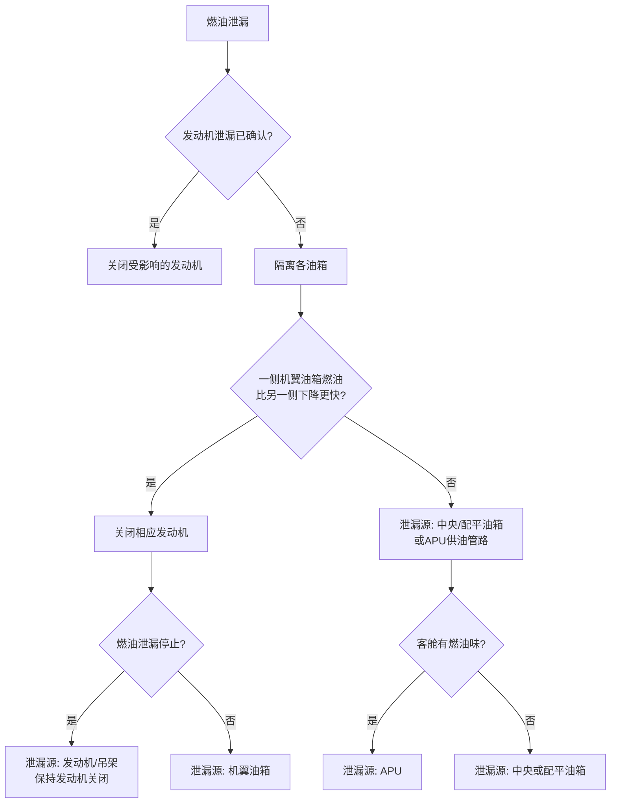

# A330 飞行机组技术手册 - 燃油泄漏程序

**文件来源：** 中国东方航空 A330 飞行机组技术手册 (FCTM)
**章节：** 非正常和应急程序 - 燃油
**主题：** 燃油泄漏 (FUEL LEAK)

---

## PR-AEP-FUEL 第 1/4 页

### 概述

**文件标识：** PR-AEP-FUEL-10-00026738.0005001 / 21年5月25日
**适用于：** 所有飞机

当飞机飞越航路点时，或至少每30分钟，应进行燃油检查。任何差异都应提醒飞行机组，并应立即进行调查。
*参考 FCOM/PRO-NOR-SOP-15 巡航 - 飞行进程。*

对于任何与燃油量或燃油不平衡相关的信息或警告，飞行机组应将燃油泄漏视为一种可能原因。

如果在监控燃油量和消耗的某个系统触发ECAM警告之前，飞行机组发现了燃油泄漏，飞行机组可以启动 **[QRH] 燃油泄漏** 程序。

---

### 指示和观察表

**文件标识：** PR-AEP-FUEL-10-00026739.0001001 / 21年5月25日

| 指示和观察 | 对称/不对称 | 可能的燃油泄漏源 |
| :--- | :--- | :--- |
| **从发动机/吊架可见燃油喷出**   仅在一侧发动机：   - 燃油流量过大，或   - N1指示显著下降。   **一侧机翼油箱的燃油量异常快速减少** | 不对称 | 发动机 |
| **从机翼可见燃油喷出**   **一侧机翼的燃油量异常快速减少** | 不对称和对称 | 油箱有破洞 |

*续下页*

---

## PR-AEP-FUEL 第 2/4 页

*续上页*

| 指示和观察 | 对称/不对称 | 可能的燃油泄漏源 |
| :--- | :--- | :--- |
| **其中一个油箱突然溢油** | 不对称和对称 | 管路有破洞 |
| **出现燃油不平衡**   **客舱有燃油烧焦味**   **总燃油量异常减少**   **[机上燃油 + 已用燃油] < 初始加油量**   **机上燃油与飞行计划中飞越航路点时的预计燃油之间存在差异**   **目的地预计机上燃油（EFOB）正在减少或在FMS飞行计划页面上显示为琥珀色。** | 不对称和对称 | 发动机、油箱有破洞、管路有破洞、APU |

---

### 应用原理

**文件标识：** PR-AEP-FUEL-10-00026740.0003001 / 21年5月25日

[QRH] **燃油泄漏** 程序将帮助飞行机组识别泄漏源。[QRH] **燃油泄漏** 程序的主要步骤是：

*   **如果确认燃油从发动机/吊架泄漏：**
    *   关闭受影响的发动机以隔离燃油泄漏，并可根据需要使用燃油交输活门。

*   **如果未确认燃油从发动机/吊架泄漏或泄漏位置不明：**
    *   隔离每个油箱：保持交输活门关闭并关闭中央油箱泵。每个机翼油箱为其对应的发动机供油。
    *   如果一个机翼油箱的燃油量比另一个减少得快，则确定燃油泄漏来自该机翼油箱。在这种情况下，关闭相应的发动机，以确认泄漏是来自机翼油箱还是发动机。
    *   如果两个机翼油箱的燃油量对称减少，且中央油箱的燃油量也在减少，则燃油泄漏来自中央油箱或APU供油管路。

*   **如果飞行机组确认燃油泄漏来自发动机/吊架，必须关闭发动机以便：**
    *   停止泄漏。
    *   防止燃油泄漏到发动机热表面造成火灾危险。

---

## PR-AEP-FUEL 第 3/4 页

### 燃油泄漏故障排除

### 不要使用反推

**文件标识：** PR-AEP-FUEL-10-00026741.0003001 / 21年5月25日

使用反推装置会在飞机周围产生一些气流。当燃油从油箱、吊架或发动机泄漏时，这种气流会将泄漏的燃油吹向发动机进气口和/或刹车，可能产生以下影响：
-   发动机吸入燃油可能导致发动机过热和/或引发火灾。
-   燃油接触刹车可能降低刹车性能和/或在高温刹车上引发火灾。

因此，即使反推装置可用，在着陆时也不要使用。

### 着陆性能计算

当油箱、吊架或发动机发生燃油泄漏时，飞行机组在计算着陆性能时必须将反推装置视为不可用。

---
**页脚信息：**
*   **机队：** 东航 A330 机队
*   **手册：** FCTM (飞行机组技术手册)
*   **页码：** PR-AEP-FUEL 第 1-3 / 4 页
*   **日期：** 21年5月25日